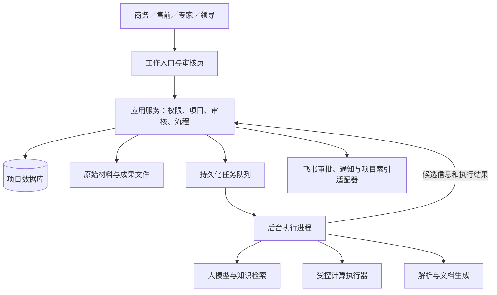

# 后勤售前数字员工系统设计方案 V3.1

> **版本：** 评审优化稿  
> **日期：** 2026 年 10 月 9 日  
> **适用业务：** 学校供餐、人员配置、仓储与物流等后勤售前业务  
> **设计基础：** 《Logistics Pre-Sales AI System Design and Implementation Specification V3.0》，并参考《教育共享 LTC 场景组织 AI 转型产品方案 v2（初稿）》。

本方案基于 V3.0 重构，保留 ST1–ST4 的业务边界，简化技术实现和交付顺序。正文可独立阅读，不隐含继承未随评审材料提供的 V2.0 条款。

## 1. 建设目标与系统定位

建设一个围绕项目持续工作的售前数字员工，帮助商务和售前人员完成材料整理、信息核实、方案编写、尽调准备、测算辅助和任务跟进。

系统以长期项目档案为核心。用户再次拜访、补充材料或调整合作条件时，系统在同一项目下识别变化、提示影响并组织后续工作。

数字员工承担标准化准备和执行工作；业务人员负责关键事实、审批、专业判断和正式成果。

首期重点解决四个问题：

1. 项目材料分散，关键事实和来源难以查找。
2. 多轮拜访和方案修改容易丢失上下文。
3. 信息补充、审核和测算之间缺乏连续跟进。
4. 已发布材料与最新项目条件不一致，历史依据难以追溯。

## 2. 业务范围与人机分工

| 阶段 | 系统主要工作 | 主要成果 | 人工责任 |
| --- | --- | --- | --- |
| ST1 商机初判 | 整理线索，提取基础信息，识别缺口和风险 | 《商机初判》、补充信息清单 | 决定继续跟进、暂停或关闭 |
| ST2 商务接洽 | 整理每次拜访，比较条件变化，更新合作方向 | 《拜访记录与线索补充》《合作方向与方案》 | 确认客户意向、关键条件和合作方向 |
| ST3 尽职调查 | 准备申请、清单和行程，汇总现场材料，组织核实 | 《尽调申请》《调研清单》《调研行程单》《尽调报告》 | 审批、材料审核、交接、现场执行与专业确认 |
| ST4 测算与谈判 | 整理测算参数，执行真实计算，比较谈判前后变化 | 《商务谈判与条件补充》《测算方案》及计算附件 | 确认参数、复核结果、决定谈判与发布内容 |

ST5 仅保留人工阶段标识。首期不建设投资决策自动化、正式《合作建议书》、合同、投标、资质评分及客户自动发送功能。

《合作方向与方案》表达讨论中的业务方向，不构成正式报价或对外承诺。

系统按以下边界执行：

| 执行方式 | 适用动作 |
| --- | --- |
| 在已授权任务或规则下自动执行 | 解析材料、生成候选信息、检查缺失项、比较版本、生成指定草稿、更新内部待办、同步项目索引 |
| 必须由人确认 | 采纳关键事实和参数、确认合作方向、提交审批、改变项目阶段、复核计算结果、发布正式成果 |
| 必须交由实际责任人处理 | 领导审批、客户承诺、谈判决策、投资判断、专业例外处理 |

主要角色包括项目负责人、售前/解决方案人员、领域专家、业务领导和系统管理员。管理员配置系统，不因此获得业务审批权。

## 3. 产品入口与总体架构

首期采用一个主要工作入口，并提供飞书多维表格项目索引。

工作入口负责选项目、上传材料、查看待办、审核信息和获取成果。若 WorkBuddy 已具备所需身份、文件和审核能力，可以作为入口；能力不足时，通过链接进入轻量 Web 审核页。

多维表格仅展示项目摘要、阶段、负责人、阻塞事项和成果链接，业务事实以系统数据库为准。



采用模块化单体应用，内部划分五类业务模块：

- 项目、材料与事实；
- 审核、流程与待办；
- AI 能力与知识；
- 文档与版本；
- 测算与结果。

后台执行进程与主应用共享业务契约，解析和计算使用隔离的执行环境。首期不按 Skill 拆微服务。

推荐使用 Python、FastAPI、Pydantic、SQLAlchemy、PostgreSQL 和企业文件存储。已有企业技术栈满足要求时可复用。初期使用数据库任务表，无须预先引入消息中间件、独立向量数据库或通用插件平台。

默认开发、测试和生产统一使用 PostgreSQL。如果必须提供便携离线演示，可使用独立 SQLite 演示版本，但演示数据不自动转为生产数据。

## 4. 项目数据与版本管理

核心数据对象如下。

| 对象 | 保存内容 |
| --- | --- |
| 项目 | 稳定项目编号、负责人、成员、区域、阶段、状态 |
| 原始材料 | 原文件、上传人、文件哈希、来源、访问权限 |
| 候选变更与审核记录 | 新旧值、证据、审核时看到的内容、决定及理由 |
| 项目事实与事实历史 | 当前采纳值、历史版本、业务口径、依据和确认人 |
| 业务待办 | 负责人、依赖、期限、阻塞原因、完成依据 |
| 后台任务 | 执行状态、输入快照、重试次数、恢复位置、错误 |
| 尽调记录 | 审批实例、审批依据、材料审核、交接与现场状态 |
| 文档与测算记录 | 输入快照、版本、文件、运行结果、复核与发布记录 |
| 知识、审计与同步记录 | 正式知识版本、业务操作历史、待同步事件 |

项目事实使用以下联合标识，避免不同学校范围或年份相互覆盖：

`项目编号＋字段编号＋适用范围＋业务期间`

每个事实至少包含值、类型、单位、期间、范围、来源、依据类型、确认人和确认时间。

以下语义必须区分：

| 表达 | 含义 | 测算处理 |
| --- | --- | --- |
| 未知 | 尚无可采纳值 | 必填参数未知时阻断 |
| 已确认的零 | 已确认该数量或费用为零 | 按零参与计算 |
| 不适用 | 该事项不适用于当前范围 | 按模型批准的映射规则处理 |
| 批准标准 | 采用适用范围和有效期内的标准 | 引用标准版本并明确标记 |
| 明确假设 | 人工批准用于指定测算情景的假设 | 显示假设，不能称为现场核实数据 |

候选信息和冲突信息不直接覆盖当前事实。未解决的关键冲突会阻断依赖该字段的测算或正式成果，不必阻断整个项目。

事实更新时追加历史版本并更新当前值。测算、审核和发布按需冻结所依赖的数据；不再长期维护多份同等权威的项目 JSON。

并发和一致性规则：

- 同一字段的确认必须检查原事实版本，防止静默覆盖。
- 不同字段的正常更新，不因无关项目变更被整体拒绝。
- 同一请求重复提交，只产生一次业务结果；同一幂等键携带不同内容时拒绝。
- 业务修改、审核记录、审计和待同步事件在一个数据库事务中提交。
- 项目版本用于排序和追溯，不能替代字段级并发控制。

## 5. 工作流与主动任务

项目阶段由授权人员改变。普通任务完成、AI 评分或文档生成都不自动代表阶段通过。

系统将业务待办和后台任务分开：

- **业务待办**表示需要谁完成什么，例如补齐学生人数、审核参数。
- **后台任务**表示程序正在执行什么，例如 OCR、生成文档、运行测算。

两者在同一个工作界面展示，但状态和完成条件分别管理。

主动推进由明确规则驱动。例如：

| 事件 | 自动处理 | 人工处理 |
| --- | --- | --- |
| 上传拜访材料 | 提取信息、生成拜访草稿和差异清单 | 确认关键变化 |
| 缺少测算必填项 | 按配置生成补充信息待办 | 补充和确认数据 |
| 关键事实被修改 | 标记相关成果需更新，生成复核或重算待办 | 决定重算及后续发布 |
| 审核退回 | 保留意见，将关联任务转回修改状态 | 修改并重新提交 |
| 可信审批结果到达 | 更新真实审批进度，检查后续条件 | 完成材料审核与交接 |

已经配置负责人和适用条件的必要待办，可以由规则直接创建。AI 临时提出的可选行动仍作为建议，由用户接受。

相同事项应合并，已拒绝的建议在没有实质新依据时不重复提出。关联业务审核完成后，系统可以自动关闭对应待办，无须用户重复点击完成。

后台任务必须支持用户离开后继续执行、查看进度和失败恢复。重试使用稳定任务标识；对外部审批提交等操作，结果不确定时先查询真实状态，不能盲目重复提交。

执行前和恢复时重新检查权限。原授权失效时暂停相关操作并提示处理。

## 6. ST1–ST3 业务流程

ST1 和 ST2 共用以下主流程：

`接收材料 → 提取候选信息 → 比较现有事实 → 人工审核 → 更新项目 → 生成或更新文档草稿 → 发布 → 跟进待办`

商机初判应明确区分事实、缺失信息、风险和建议，最终跟进决定由项目负责人作出。

每次拜访建立独立 `visit_id`。第二次拜访不能覆盖第一次拜访；修改第一次拜访时，仅增加该拜访记录的修订版本。

生成《合作方向与方案》前，应确认合作目标、服务范围、关键约束和待解决问题。借鉴教育共享方案的做法，将这些内容作为简短的“业务问题与合作方向确认清单”，减少基于未经确认的理解生成长篇方案。

尽调采用一个业务记录，分别保存：

- 外部审批状态及两个领导审批席位；
- 审批依据是否仍适用；
- 材料审核状态；
- 交接状态；
- 现场执行状态。

尽调报告复用公共文档审核与发布流程，不另建重复状态机。

正式现场执行条件为：

```text
两个规定的领导席位均已真实批准
且审批依据仍然适用
且材料审核通过
且交接完成
```

准备申请和草拟清单可以发生在审批前，但不代表已经获得现场执行授权。

两个审批席位使用实际配置的责任人及代理规则，不能通过重复记录同一次决定凑齐。审批回调需验证来源，并在必要时查询权威实例状态；不能依据聊天文字判断审批通过。

若关键条件或审批材料发生实质变化：

1. 保留外部平台原有审批结果。
2. 将当前审批依据标记为已变化。
3. 关闭受影响的执行门槛。
4. 按真实业务流程补充材料、撤回或重新提交。

无关的拜访补充信息不应使审批自动失效。哪些变化属于实质变化，需要业务负责人定义。

演示回放应明确标注，不生成虚构的领导批准或交接完成记录。

## 7. ST4 测算与谈判支持

财务结果由经过验证的确定性计算程序产生。大模型只负责提取候选参数、组织信息和解释已有结果。

保留三种业务情景：

| 情景 | 定义 |
| --- | --- |
| V0 | 调研前，使用已采纳事实、适用标准和批准假设 |
| V1 | 调研后，以确认的现场数据更新选定基线 |
| V2 | 谈判或条件调整后，以确认的变化更新选定基线 |

每次运行都有独立编号和明确基线。V0、V1、V2 是测算情景，与文档第几版无关。

正式模型启用前必须具备：

- 经业务确认的公式模型；
- 输入、输出位置和数据口径；
- 精度、舍入及异常值规则；
- 业务批准的标准输入输出样例；
- 适配该模型的计算执行器。

V3.0 记载现有 V0.6 工作簿没有公式。该工作簿未随本次评审材料提供，需在接收后独立核验；若情况属实，它只能作为材料或录入模板，不能作为可执行测算模型。

测算流程为：

`选择模型 → 确认参数 → 冻结输入 → 校验完整性与口径 → 真实重算 → 校验结果 → 保存附件 → 专业复核`

必须执行以下规则：

- 原始候选值不能直接进入正式模型。
- 必填值缺失不能补零。
- 仓储、装修、冷库、人员等费用的重复计入检查，依据批准模型的成本定义执行。
- 只写入 Excel 单元格不算完成重算。
- 不支持的公式、错误单元格或无法确认的新结果应判定失败。
- 宏、外部链接和外部数据依赖必须受控，未经批准不得执行。
- 保存输入、输出、实际重算后的文件、执行器版本和运行日志。

测算成功后进入待复核状态。只有指定专业人员确认，才能成为当前正式测算结果。

首期差异分析只输出：

- 参数修改前后值及依据；
- 两次真实运行的结果差异；
- 可比性说明。

基准为零时，百分比变化显示“不适用”，不能计算无意义比率。模型或口径不同且未定义转换规则时，不直接比较。

首期不建设多因素归因。AI 可以说明哪些参数发生变化，但不能把利润变化精确归因于某个因素，除非存在相应计算证据。

演示模型可以用于验证技术链路，但必须标记为演示数据，其输出不得进入正式业务《测算方案》。

## 8. 文档生成、审核与发布

所有阶段复用一套文档机制：

`生成草稿 → 人工审核 → 修改或通过 → 正式发布`

首期优先提供 Word 文档，按需要导出 PDF；测算保留 Excel 附件。PPT 不作为默认交付要求。

模板应定义必需章节、关键数据、审核要求和引用方式。缺少正式模板时，可生成明确标记的参考草稿，不能宣称已完成正式发布。

每份正式成果至少保留：

- 项目和文档实例编号；
- 文档版本及模板版本；
- 所用事实、知识和测算的版本；
- 审核人、发布人和时间；
- 来源与依据清单；
- 文件哈希。

生成后执行统一检查：

- 必需章节是否完整；
- 是否遗留占位符；
- 关键数字是否与已采纳数据一致；
- 引用是否支持对应结论；
- 是否混入其他项目内容；
- 假设、未知项和风险是否明确；
- 测算是否已真实执行并复核。

正式发布前，检查实际依赖的数据是否发生变化。无关字段更新不应迫使整份文档重新审核。

文件生成成功并完成完整性检查后，才能在数据库中登记正式版本并更新当前成果链接。文件写入失败、审核未完成或同步失败都不能制造虚假的已发布记录。

已发布版本不覆盖。历史版本继续可查，新条件通过新版本体现。

同一责任人可以在一个界面完成结果复核和文档发布，但不能提前批准尚未生成的测算结果。

## 9. AI 能力与知识管理

首期将 AI 能力收敛为四类：

| 能力 | 主要输出 |
| --- | --- |
| 信息提取 | 字段候选、来源位置、疑点和缺失项 |
| 业务分析 | 商机风险、核实问题、合作方向建议 |
| 文档编写 | 基于指定模板和项目快照的草稿 |
| 变化解释 | 对已有字段差异、任务规则和计算结果的解释 |

解析文件、换算单位、比较数值、校验权限、推进状态和执行财务公式，使用确定性程序。

所有 AI 输出经过结构校验。证据定位、审核状态和采纳状态由后端确定，不能由模型自行声明。

长材料按页、章节或工作表分段处理，保留原始位置。附件中的指令文字作为业务内容处理，不改变系统权限或执行规则。

知识分为三类：

1. **正式规则与标准**：有负责人、版本、适用范围和有效期。
2. **经审核的案例与方法**：用于参考，不能替代当前项目事实。
3. **项目材料与经验候选**：受项目权限约束，未审核前不成为公共规则。

先采用人工整理、标签、关键词或全文检索。只有在检索效果确有不足时，再增加语义检索设施。

专家修改意见可以提交为知识候选。经脱敏、适用范围检查和专业审核后，才发布为正式知识版本。一次项目例外不能自动升级为全公司的执行规则。

没有授权区域资料时，返回资料缺口和采集建议，不生成看似真实的区域画像。

大模型供应商、提示词和模型版本统一管理，并记录调用成本。具体框架，包括教育共享方案提及的 Harness，需经过功能、许可、权限隔离和恢复能力验证后再采用。

## 10. 权限、集成与运行保障

权限以项目为边界，在服务端校验用户、项目成员关系、角色和具体操作。

项目参与人可按授权共享材料和成果；任务临时上下文相互隔离。项目编号、文件路径或加入某张多维表格，都不能单独构成访问授权。

飞书等集成通过适配器接入：

- 用户主动操作按接口要求使用用户授权；
- 后台同步和查询仅在接口支持且管理员授权的范围内使用应用身份；
- 无论使用何种身份，仍需执行本系统的项目和动作权限检查；
- 令牌有效期依据实际接口响应处理，不写死文档中的示例时长。

多维表格首期采用单向同步。同步失败显示“业务已保存，索引同步待重试”，不回滚项目事实。旧版本事件不得覆盖新版本投影。

保留必要的运行保障：

- 文件类型、大小、路径和解析隔离检查；
- 计算执行的时间和资源限制；
- 密钥安全存储、日志脱敏和受控文件下载；
- 追加式审计记录及应用账号修改限制；
- 数据库、文件和配置备份，以及恢复演练；
- 后台任务租约、超时、重试和重复执行保护。

首期不强制建设审计哈希链和逐项目密钥销毁体系。数据保留、删除和备份清理规则需单独明确；若有独立防篡改证明要求，再增加外部存证或不可改写存储。

系统应能回答四个问题：这个数字来自哪里、谁确认过、哪个模型算出了结果、哪个版本被正式发布。

## 11. 分期实施与外部依赖

建议按四个里程碑推进。

| 里程碑 | 建设内容 | 通过条件 |
| --- | --- | --- |
| M0：依赖验证 | 验证入口审核能力、身份接口、模型样例、文件生成和计算执行器 | 形成实际验证结果及阻塞清单 |
| M1：最小业务闭环 | 拜访材料→候选→确认→项目更新→文档；另验证一次真实计算及差异 | 来源可查、历史保留、人工确认可见、文件可打开 |
| M2：ST1–ST2 上线 | 多用户权限、商机和拜访、合作方向、任务恢复、通知和项目索引 | 真实项目试用通过 |
| M3：ST3–ST4 上线 | 真实审批、材料审核与交接、尽调报告、生产模型、测算复核 | 实际审批及业务标准答案验证通过 |

与 V3.0 相比，M1 建议由完整 ST1–ST4 实施演示缩小为最小闭环。其他阶段可以展示流程回放，但不能计为真实集成验收。若全流程演示已构成既有交付承诺，应单独保留相应工作量。

原文中的 10 月底、11 月初及 11 月底节点可作为期望窗口，不能在接口、业务模型和团队容量未确认时作为保证日期。

上线依赖如下：

| 必要输入 | 建议责任方 | 缺失时的处理 |
| --- | --- | --- |
| 公式模型、参数映射、标准答案及成本口径 | 解决方案负责人 | 阻断正式测算 |
| 真实材料、字段定义、业务模板 | 商务与售前负责人 | 明示缺口，仅提供参考草稿 |
| 审批模板、责任人、代理及条件变化处理规则 | 业务领导与飞书管理员 | 阻断正式尽调执行 |
| 身份、文件存储、数据库和备份环境 | IT | 不开展生产多用户运行 |
| 大模型数据使用范围、知识标准和保留规则 | IT、安全及业务负责人 | 使用脱敏测试材料验证 |

## 12. 验收标准与效果评估

验收以完整业务行为组织，技术细项保留在研发测试清单中。

| 验收场景 | 必须达到的结果 |
| --- | --- |
| 上传重复名称或恶意指令材料 | 文件历史保留；材料文字不能触发越权操作 |
| 提取未知、零、假设和冲突数据 | 语义正确区分，关键缺失不补零 |
| 核查来源与业务口径 | 来源可定位；对象、期间、范围和单位可核对 |
| 两人同时修改及请求重试 | 同字段冲突被发现；无关字段可正常更新；无重复业务结果 |
| 同项目多次拜访 | 每次记录独立，修订不覆盖其他拜访 |
| 后台中断与恢复 | 任务可恢复，外部副作用不重复，权限失效后暂停 |
| 尽调审批不完整或依据变化 | 正式执行门槛关闭，保留真实历史 |
| 执行生产测算 | 与业务批准的标准答案按既定精度一致 |
| 演示模型、未复核结果或公式错误 | 不能进入正式业务成果 |
| 参数变化与文档更新 | 历史不覆盖，相关成果提示更新，发布依赖被检查 |
| 项目越权与同步失败 | 未授权访问被拒绝；同步失败不损坏业务事实 |
| 模型、提示词或解析器升级 | 重跑评测，关键退化时阻止发布 |

每项验收结果记录为“通过、失败、依赖阻塞”。依赖阻塞不计为通过。

试运行重点跟踪：

- 从材料提交到可审核草稿的时间；
- 专家修改比例和审核耗时；
- 关键事实采纳、纠正与拒绝情况；
- 待办积压、任务失败和恢复情况；
- 单项目 AI 与人工审核成本；
- 正式成果的业务错误和版本追溯情况。

首轮试运行先建立基线，再设定提效目标。越权、虚构审批、假数据进入正式测算等严重错误，作为上线阻断项。
